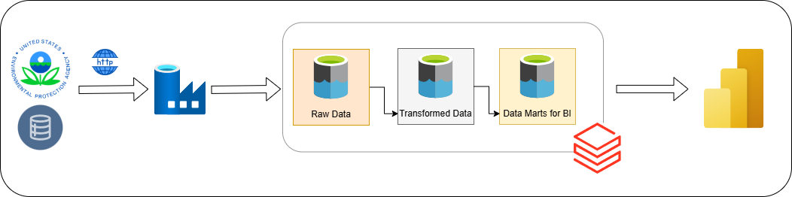

# 🌍 Air Quality Data Pipeline in Azure

## Project Overview
This project showcases a **large-scale data pipeline** built in **Azure** to process and visualize **hourly air quality data** from the US government. The pipeline efficiently handles both **gas concentration** and **meteorological data**, transforming raw data into a structured **data warehouse** optimized for **Power BI** analytics.

---

## Key Features
-> **Scalable Data Processing** for **3.02 billion+ rows**  
-> **Optimized Storage** using **Delta Lake**  
-> **Partitioning Strategy** for efficient queries  
-> **Databricks & Azure Data Factory Integration**  
-> **Business Intelligence Dashboard with Power BI** 

#### Lineage

---

## 🛠️ Tech Stack
- **Cloud:** Azure
- **ETL:** Azure Data Factory (ADF), Databricks
- **Storage:** Azure Data Lake (ADLS Gen2), Delta Lake
- **Processing:** Apache Spark
- **Visualization:** Power BI
- **Governance and Lineage:** Unity Catalog

---

## Data Pipeline Steps
### - **Data Ingestion**
- **Source:** US Government website (hourly air quality data)
- **Data Types:** Gas pollutants (CO, NO2, etc) & meteorological parameters (dew point, pressure, etc)
- **Batch Processing:** Yearly ingestion from **1980 to 2024**

### - **Raw Data Storage (Bronze Layer)**
- **Technology:** Azure Data Factory (ADF)
- **Storage:** Azure Data Lake (ADLS Gen2)
- **Format:** CSV
- **Scale:** **400GB+ Raw Data**

### - **Data Transformation & Optimization (Silver Layer)**
- **Technology:** Azure Databricks
- **Conversion:** CSV → Parquet (compressed format)
- **Storage Format:** Delta Lake
- **Partitioning Strategy:** **Year & State**

### - **Data Warehouse (Silver Layer)**
- **Technology:** Databricks with Access Connector
- **Schema:** **Star Schema** for optimized analytics
- **Partitioning Strategy:**
  - Fact tables partitioned by **Year & State**
  - Dimension tables optimized for quick lookups
- **Query Optimization:** Delta Lake indexing & caching

### - **Optimized Analytics Layer & Visualization (Gold Layer)**
- **Materialized Views:** Created using **Databricks SQL**
- **Partitioned Views:** By **Year, State & Measurement Type**
- **Final Dashboard:** Power BI for business insights

---

## Scaling Considerations
- **Databricks Cluster Management:**
  - Used a **single-node free-tier cluster**
  - **Sequential execution per year**
  - **Parallelized processing within each year**
- **Performance Enhancements:**
  - Optimized joins using **Delta Lake indexing**
  - Partitions for faster queries

---

## Final Dashboard
The processed data is visualized in **Power BI**, providing insights into:
- **Time-series trends of air quality**
- **State-wise pollutant distribution**
- **Parameter-wise comparisons for analysis**

---

